# Pesquisa A STDMSP — análise por raça

**Fonte:** *Condições de Trabalho para as Trabalhadoras Domésticas (Responses).xlsx* — STDMSP, campo 2024 (n=242, auto-administrada via Google Forms).

**Recortes:**

- **Afro-descendentes** (pardas + pretas): n=140
- **Brancas**: n=93
- **Total race-known**: n=233 (exclui 2 Amarela/Indígena + 7 sem resposta de raça)

**Critério de discrepância:** diferença afro – brancas ≥ 10 pontos percentuais (em negrito na coluna Δ das tabelas).

**Referências 2024 para o item 4 (salário):** R$ 1.412,00 = salário mínimo federal · R$ 1.476,75 = piso CC doméstica SP.

---

## Q01 — Idade

*Distribuição por faixa etária*

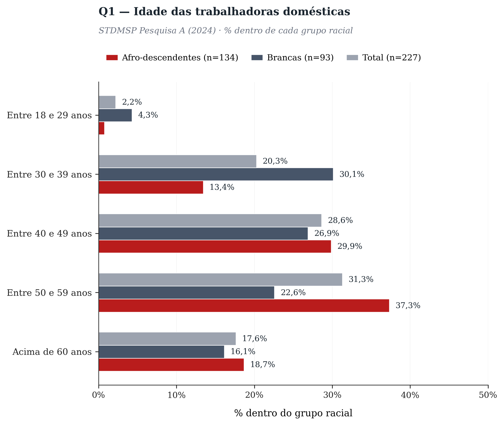

| Categoria | Afro | Brancas | Total | Δ (pp) |
|---|---:|---:|---:|---:|
| Entre 18 e 29 anos | 0,7% (1) | 4,3% (4) | 2,2% (5) | -3,6 |
| Entre 30 e 39 anos | 13,4% (18) | 30,1% (28) | 20,3% (46) | **-16,7** |
| Entre 40 e 49 anos | 29,9% (40) | 26,9% (25) | 28,6% (65) | +3,0 |
| Entre 50 e 59 anos | 37,3% (50) | 22,6% (21) | 31,3% (71) | **+14,7** |
| Acima de 60 anos | 18,7% (25) | 16,1% (15) | 17,6% (40) | +2,5 |

A categoria é envelhecida em ambos os grupos raciais — ~70% têm 40 anos ou mais. **Mas a distribuição etária é racialmente assimétrica:** **brancas concentram-se em 30-39 anos** (30,1% vs 13,4% afro, gap -16,7pp), enquanto **afro concentram-se em 50-59 anos** (37,3% vs 22,6% brancas, gap +14,7pp). Quase 56% das afro têm 50+ anos vs ~39% das brancas. Interpretação possível: trajetórias raciais diferentes na categoria — afro permanecem (ou se reinserem) mais tempo no trabalho doméstico; brancas entram e saem em fases mais jovens.

---

## Q02 — Composição racial

*Pardas + Pretas = afro-descendentes (n=140)*

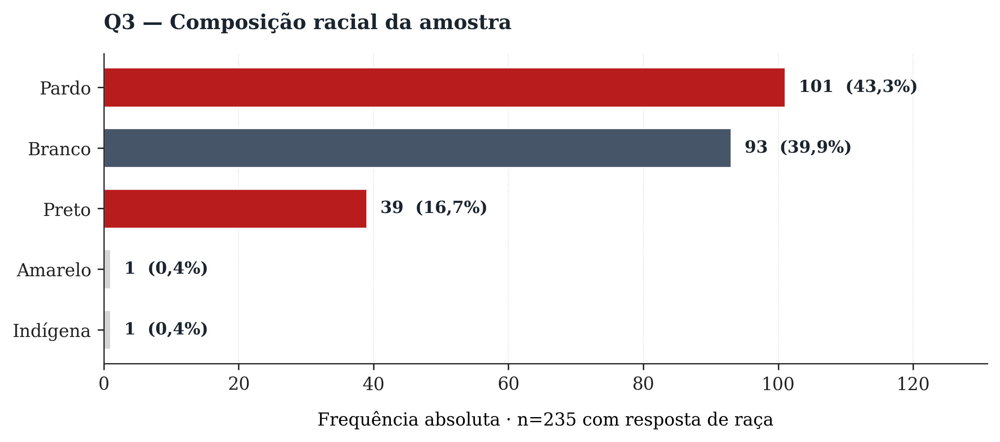

| Categoria | Afro | Brancas | Total | Δ (pp) |
|---|---:|---:|---:|---:|
| Pardo | — (101) | — (0) | 43,3% (101) | — |
| Branco | — (0) | — (93) | 39,9% (93) | — |
| Preto | — (39) | — (0) | 16,7% (39) | — |
| Amarelo | — (0) | — (0) | 0,4% (1) | — |
| Indígena | — (0) | — (0) | 0,4% (1) | — |

Da amostra com resposta de raça (n=235), **140 são afro-descendentes** (pardas + pretas) e **93 são brancas**. A composição da amostra A (60% afro) é semelhante à composição racial da categoria doméstica em São Paulo observada na PNADC (~56-60% pretas + pardas em 2024-2026).

---

## Q03 — Diarista vs vínculo

*% da amostra em cada modalidade*

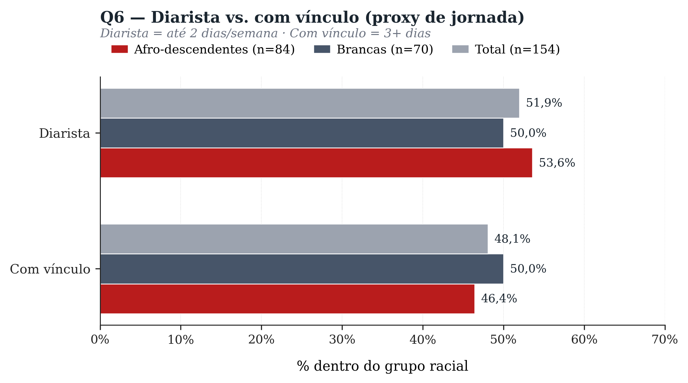

| Categoria | Afro | Brancas | Total | Δ (pp) |
|---|---:|---:|---:|---:|
| Diarista | 53,6% (45) | 50,0% (35) | 51,9% (80) | +3,6 |
| Com vínculo | 46,4% (39) | 50,0% (35) | 48,1% (74) | -3,6 |

Aproximadamente metade da amostra trabalha como diarista, metade com vínculo. **Diarismo = jornada parcial** legal (LC 150/2015 art. 1º §1º) e implica exclusão da maioria dos direitos previdenciários automáticos.

---

## Q04 — Salário base

*R$ por mês · faixas*

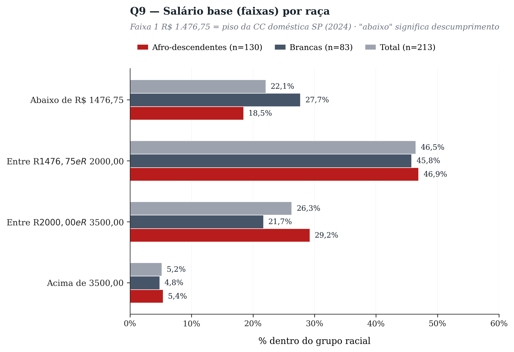

| Categoria | Afro | Brancas | Total | Δ (pp) |
|---|---:|---:|---:|---:|
| Abaixo de R$ 1476,75 | 18,5% (24) | 27,7% (23) | 22,1% (47) | -9,2 |
| Entre R$ 1476,75 e R$ 2000,00 | 46,9% (61) | 45,8% (38) | 46,5% (99) | +1,1 |
| Entre R$ 2000,00 e R$ 3500,00 | 29,2% (38) | 21,7% (18) | 26,3% (56) | +7,5 |
| Acima de 3500,00 | 5,4% (7) | 4,8% (4) | 5,2% (11) | +0,6 |

**Referências 2024:** salário mínimo federal R$ 1.412,00 · piso da Convenção Coletiva doméstica SP R$ 1.476,75 (Faixa 1).  
**Achado inesperado — o gap racial vai na direção contrária do padrão PNADC:** 18,5% das afro vs **27,7% das brancas** recebem abaixo do piso CC. Ou seja, **brancas estão mais abaixo do piso** que afro nesta amostra (Δ -9.2pp). Faixa central R$ 1.476-2.000: ~46% em ambos os grupos. No topo (>R$ 3.500): 5,4% afro vs 4,8% brancas — paridade. 

**Interpretação cautelosa:** o resultado provavelmente reflete o viés da amostra de conveniência STDMSP. As brancas que respondem à pesquisa do sindicato podem ser sistematicamente diferentes das brancas no PNADC — talvez mais periféricas, mais velhas (idade não bate, ver Q1 — brancas são mais jovens, na verdade), ou em arranjos mais informais. **Esse achado precisa de validação contra PNADC com filtro de UF=SP + raça antes de qualquer interpretação política.**

---

## Q05 — Valor da diária

*Apenas diaristas (n=73)*

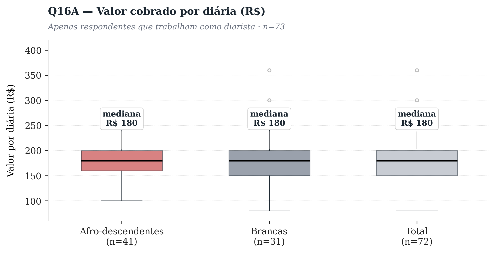

Mediana da diária: afro **R$ 180** vs brancas **R$ 180** (+0% diferença).  **Sem hiato racial na mediana** dentro da amostra STDMSP — diferente do padrão PNADC 1T 2026 que mostra hiato salarial por hora de 84,3% no diarismo BR-wide. Possíveis explicações: (a) viés da amostra de conveniência; (b) homogeneização do mercado paulista entre quem chega ao raio de atuação do sindicato; (c) tamanho amostral pequeno (n=73) — dispersão alta, mediana insensível a outliers.

---

## Q06 — Horas extras

*Recebem ou não pagamento por hora extra*

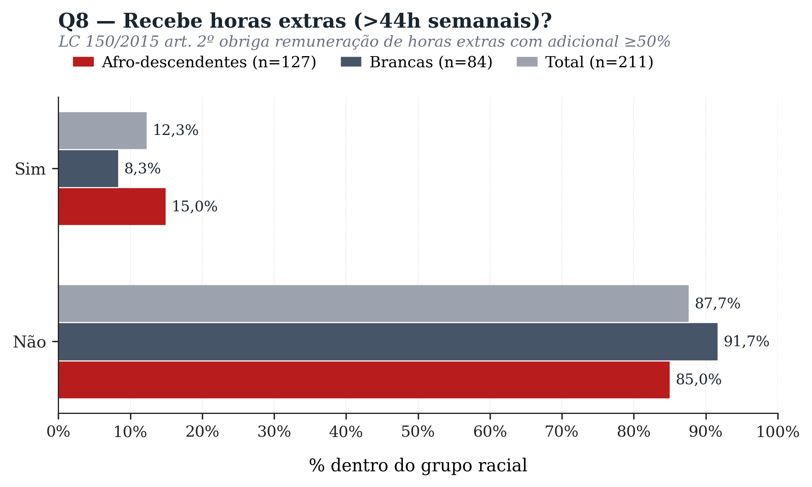

| Categoria | Afro | Brancas | Total | Δ (pp) |
|---|---:|---:|---:|---:|
| Sim | 15,0% (19) | 8,3% (7) | 12,3% (26) | +6,6 |
| Não | 85,0% (108) | 91,7% (77) | 87,7% (185) | -6,6 |

**85,0% das afro-descendentes e 91,7% das brancas **não recebem horas extras** — descumprimento generalizado da LC 150 em ambos os recortes raciais. 

---

## Q07 — Feriado 27/abr

*Proxy: como foi tratado no Dia da Trabalhadora Doméstica*

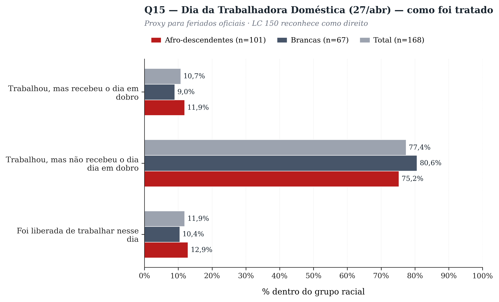

| Categoria | Afro | Brancas | Total | Δ (pp) |
|---|---:|---:|---:|---:|
| Trabalhou, mas recebeu o dia em dobro | 11,9% (12) | 9,0% (6) | 10,7% (18) | +2,9 |
| Trabalhou, mas não recebeu o dia dia em dobro | 75,2% (76) | 80,6% (54) | 77,4% (130) | -5,3 |
| Foi liberada de trabalhar nesse dia | 12,9% (13) | 10,4% (7) | 11,9% (20) | +2,4 |

Maioria absoluta trabalhou no 27/abr **sem receber dia em dobro** (afro 75,2%, brancas 80,6%). Apenas uma pequena minoria recebeu o dia em dobro como manda a lei (afro 11,9%, brancas 9,0%). 

---

## Q08 — Conhece CC?

*Conhecimento conceitual*

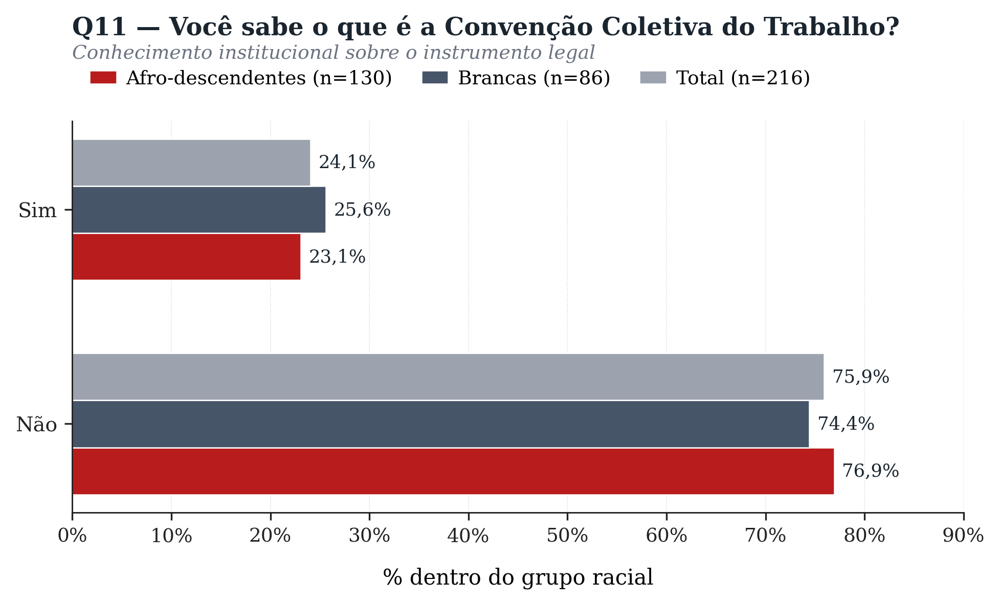

| Categoria | Afro | Brancas | Total | Δ (pp) |
|---|---:|---:|---:|---:|
| Sim | 23,1% (30) | 25,6% (22) | 24,1% (52) | -2,5 |
| Não | 76,9% (100) | 74,4% (64) | 75,9% (164) | +2,5 |

**Apenas 23,1% das afro-descendentes e 25,6% das brancas sabem o que é uma Convenção Coletiva.** Conhecimento institucional baixo em ambos os recortes — o sindicato tem trabalho de divulgação pela frente. 

---

## Q09 — Sabe da CC em SP?

*Conhecimento específico*

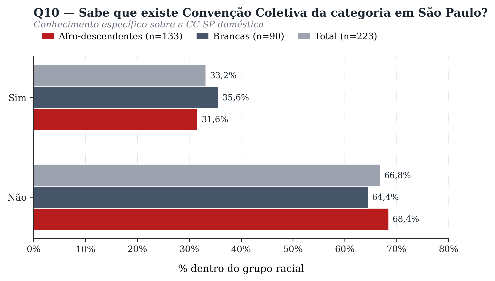

| Categoria | Afro | Brancas | Total | Δ (pp) |
|---|---:|---:|---:|---:|
| Sim | 31,6% (42) | 35,6% (32) | 33,2% (74) | -4,0 |
| Não | 68,4% (91) | 64,4% (58) | 66,8% (149) | +4,0 |

**31,6% das afro-descendentes e 35,6% das brancas** sabem da existência da CC paulista da categoria. A maioria absoluta — em ambos os grupos — não sabe. Esse desconhecimento direto da existência do instrumento que regula seus salários é o principal gargalo organizativo da STDMSP. 

---

## Q10 — CC trouxe benefício?

*Auto-avaliação*

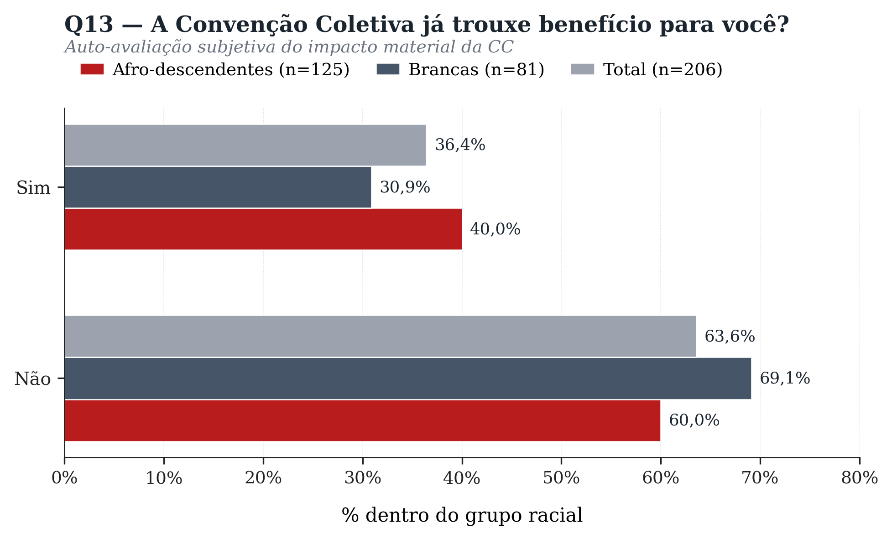

| Categoria | Afro | Brancas | Total | Δ (pp) |
|---|---:|---:|---:|---:|
| Sim | 40,0% (50) | 30,9% (25) | 36,4% (75) | +9,1 |
| Não | 60,0% (75) | 69,1% (56) | 63,6% (131) | -9,1 |

Entre quem respondeu, **40,0% das afro vs 30,9% das brancas** afirmaram ter recebido algum benefício direto da CC. O fato de a CC ter trazido benefício mesmo para quem não a conhece nominalmente (Q10/Q11) sugere que parte da categoria já se beneficia da CC sem identificar a origem. 

---

## Q11 — Sindicato ajuda?

*Confiança na estrutura sindical*

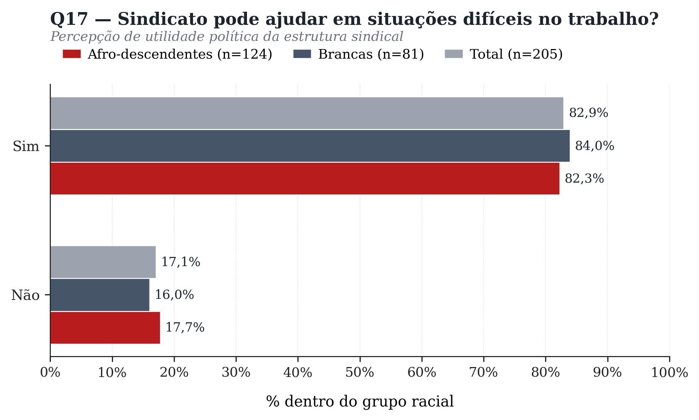

| Categoria | Afro | Brancas | Total | Δ (pp) |
|---|---:|---:|---:|---:|
| Sim | 82,3% (102) | 84,0% (68) | 82,9% (170) | -1,7 |
| Não | 17,7% (22) | 16,0% (13) | 17,1% (35) | +1,7 |

**82,3% das afro e 84,0% das brancas** acreditam que o sindicato pode ajudar em situações difíceis. Apesar do baixo conhecimento sobre CC (Q10/Q11), a confiança na ação sindical é alta — um achado político relevante para a STDMSP que pode fundamentar campanhas. 

---

## Q12 — Função do sindicato

*Texto livre categorizado em 5 buckets*

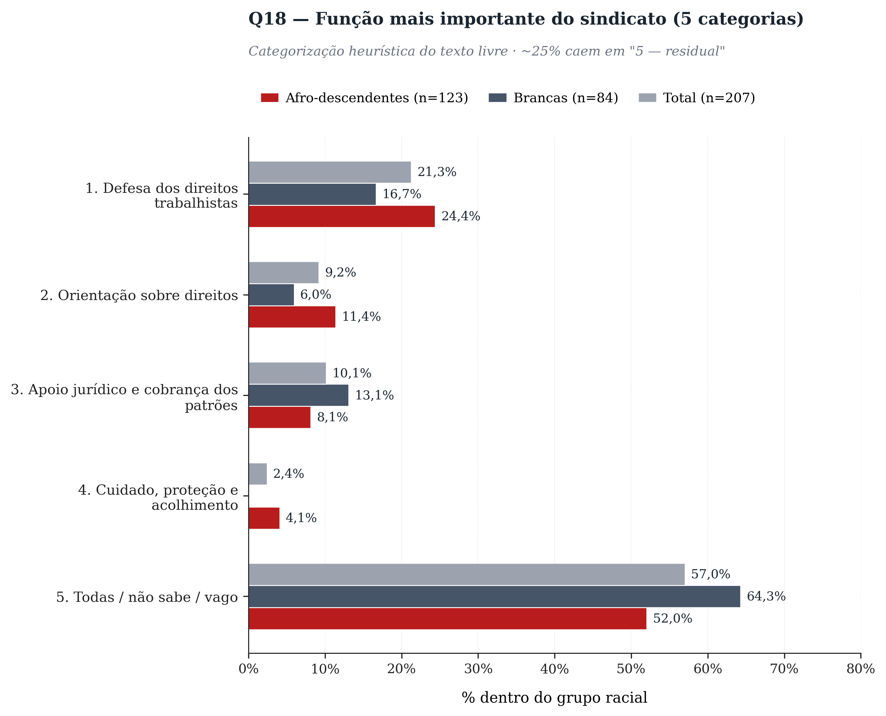

| Categoria | Afro | Brancas | Total | Δ (pp) |
|---|---:|---:|---:|---:|
| 1. Defesa dos direitos trabalhistas | 24,4% (30) | 16,7% (14) | 21,3% (44) | +7,7 |
| 2. Orientação sobre direitos | 11,4% (14) | 6,0% (5) | 9,2% (19) | +5,4 |
| 3. Apoio jurídico e cobrança dos patrões | 8,1% (10) | 13,1% (11) | 10,1% (21) | -5,0 |
| 4. Cuidado, proteção e acolhimento | 4,1% (5) | 0,0% (0) | 2,4% (5) | +4,1 |
| 5. Todas / não sabe / vago | 52,0% (64) | 64,3% (54) | 57,0% (118) | **-12,3** |

**Defesa de direitos** lidera em ambos os grupos (afro 24,4%, brancas 16,7%). Respostas residuais ('todas', 'não sei', vago) somam ~52,0% afro e ~64,3% brancas — refletem dificuldade de articular conceitualmente a função institucional. Diferença ≥10pp em **5. Todas / não sabe / vago**: afro 52,0% vs brancas 64,3% (-12.3pp).

---

## Resumo dos achados

Os dados desta pesquisa **divergem em vários pontos do padrão PNADC BR-wide** — provavelmente por se tratar de amostra de conveniência no entorno do STDMSP, com auto-seleção sistemática.

**Demografia (Q1-Q3):**

1. **Idade — diferença racial inesperada**: afro concentram-se em 50-59 anos (37%), brancas em 30-39 (30%). Afro são **15-17pp mais velhas** que brancas neste recorte. Possível leitura: trajetórias raciais diferentes — afro permanecem mais tempo na categoria, brancas circulam para fora em fases mais jovens.
2. **Composição racial**: 60% afro (pardas + pretas), alinhado com a PNADC para SP.
3. **Diarista vs vínculo (Q6)**: divisão aproximadamente meio a meio em ambos os grupos. Sem hiato racial significativo na modalidade contratual.

**Remuneração (Q4-Q5):**

4. **Salário base (Q9) — gap racial inverso**: 18,5% afro vs **27,7% brancas** recebem abaixo do piso CC (R$ 1.476,75). Ou seja, **brancas estão mais abaixo do piso que afro** nesta amostra (-9,2pp). Contra-intuitivo dado o padrão BR. Pode refletir o efeito-idade (Q1) — brancas mais jovens, talvez em arranjos menos estruturados. **Validação contra PNADC SP × raça × idade é necessária antes de qualquer leitura política.**
5. **Diária (Q16A) — sem hiato racial na mediana** (R$ 180 em ambos os grupos). Diferente do hiato BR-wide de 84,3%/hora no diarismo. Sugere homogeneização do mercado paulista no raio STDMSP, ou pequeno n=73.

**Direitos e descumprimento (Q6-Q7):**

6. **Horas extras (Q8) — descumprimento estrutural**: 88% não recebem horas extras (85% afro, 92% brancas). LC 150 ignorada em larga escala.
7. **Dia da Trabalhadora (Q15)**: ~77% trabalharam sem dia em dobro — descumprimento generalizado da regra de feriado, ambos os grupos.

**Conhecimento e organização (Q8-Q12):**

8. **Conhecimento de CC (Q10/Q11) — gargalo organizativo**: apenas ~24% sabem o que é uma Convenção Coletiva, e apenas ~33% sabem que existe uma CC paulista da categoria. **Maior lacuna informacional da pesquisa.**
9. **CC trouxe benefício (Q13)**: 36% reportam benefício direto. Afro **+9pp** vs brancas (40% vs 31%). Curioso — afro reportam benefício mais frequentemente apesar de baixo conhecimento formal.
10. **Confiança no sindicato (Q17) — alta em ambos**: ~83% acreditam que o sindicato pode ajudar. **Confiança política alta apesar do baixo conhecimento técnico** — combinação típica de organização de base.
11. **Função do sindicato (Q18)**: 'Defesa de direitos' lidera (21%). Mas **brancas dão mais respostas vagas/residuais** (64% vs 52% afro, gap -12,3pp). Afro articulam funções mais concretas — sinal de maior engajamento com a missão da categoria.

**Implicação política:** três descumprimentos generalizados (piso, horas extras, feriado) cruzados com baixo conhecimento institucional sugerem que o primeiro passo da campanha STDMSP é informacional — fazer a categoria *saber* que tem direitos antes de cobrá-los.
